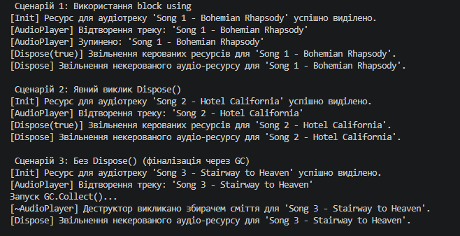

  ## Лабораторна робота No3
**Тема: Життєвий цикл об’єкта та керування ресурсами.**

  **Мета**
Поглибити розуміння життєвого циклу об’єкта в C#, навчитися працювати з некерованими
ресурсами, реалізувати інтерфейс IDisposable та патерн Dispose.

**Ключові результати порівняння сценаріїв:**

* **Використання `using`:** Найбільш надійний та рекомендований підхід. Гарантує негайне (детерміноване) звільнення ресурсів при виході з блоку коду, навіть у разі виникнення виняткових ситуацій.
* **Явний виклик `Dispose()`:** Дозволяє гнучко керувати ресурсом у довільний момент часу, але вимагає обачності: якщо між створенням об'єкта та викликом `Dispose()` станеться помилка, виклик буде пропущено.
* **Автоматична фіналізація (GC):** Деструктор (`~AudioPlayer()`) працює як страховка (fail-safe) для некерованих ресурсів. Очищення відбувається недетерміновано при роботе Збирача Сміття. Завдяки `GC.SuppressFinalize(this)` при явному виклику `Dispose()` об'єкт вилучається з черги фіналізації, зменшуючи навантаження на система.