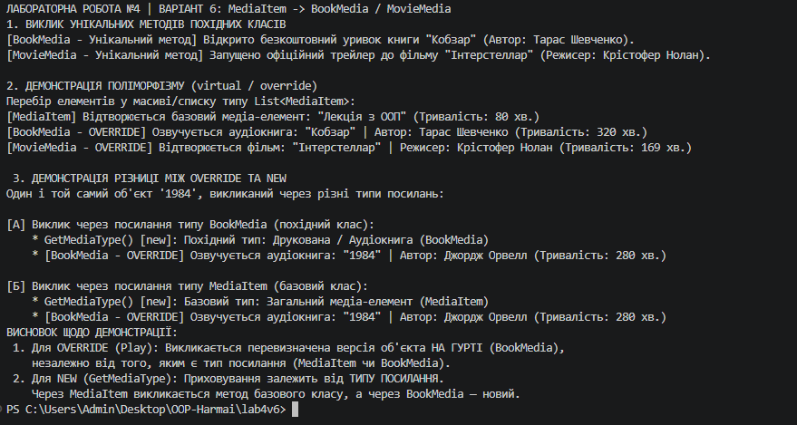

# Лабораторна робота №4

##  Тема
Наслідування. Ключові слова `base`, `override`, `virtual`. Приховування членів (`new`).

## Мета роботи
Навчитися створювати ієрархії класів, використовувати ключові слова `base`, `virtual`, `override` для реалізації поліморфізму, а також практично дослідити відмінності між перевизначенням методів (`override`) та їхнім приховуванням за допомогою модифікатора `new`.

## хід роботи 
**Реалізація базового класу `MediaItem`:**
    Описано приватні поля (`_title`, `_duration`) та публічні властивості з перевіркою вхідних даних.
    Створено конструктор для ініціалізації полів.
    Оголошено віртуальний метод `Play()` (`virtual`) для подальшого перевизначення.
    Додано метод `GetMediaType()` для демонстрації приховування членів.

**Розробка похідних класів (`BookMedia` та `MovieMedia`):**
    Налаштовано наслідування від `MediaItem` та реалізовано передачу параметрів до базового конструктора за допомогою `base(...)`.
    Перевизначено віртуальний метод `Play()` за допомогою ключового слова `override`.
    Додано унікальні методи для похідних класів: `ReadSample()` для `BookMedia` та `ShowTrailer()` для `MovieMedia`.
    У класі `BookMedia` застосовано модифікатор `new` до методу `GetMediaType()` для явного приховування одноіменного методу базового класу.
 **Демонстрація у `Program.cs`:**
    Створено об'єкти базового та похідних класів.
    Продемонстровано **поліморфну поведінку** через колекцію базового типу `List<MediaItem>`.
    Продемонстровано **різницю між `override` та `new`**: доведено, що метод `override` залежить від фактичного типу об'єкта в пам'яті, а метод `new` — від типу посилання на об'єкт.
    