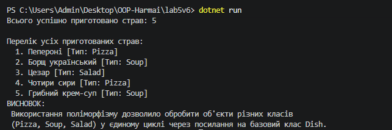

# Лабораторна робота №5: Поліморфізм та динамічне зв'язування у C#

## Тема
Поліморфізм: динамічне зв'язування та перевизначення методів.

## Мета роботи
Навчитися реалізовувати поліморфну поведінку за допомогою віртуальних методів та їх перевизначення, а також агрегувати результати поліморфних викликів.

## хід роботи
 **Реалізація базового класу `Dish`:**
    Описано приватне поле `_name` та публічну властивість `Name` з валідацією порожніх значень.
    Створено конструктор для ініціалізації базових полів.
    Оголошено віртуальний метод `virtual void Prepare()`.

 **Розробка похідних класів (`Pizza`, `Soup`, `Salad`):**
   Успадковано клас `Dish` та реалізовано передачу параметрів до базового конструктора за допомогою `base(...)`.
   Для кожного класу додано унікальну властивість (`Toppings`, `BrothType`, `Dressing`).
   Перевизначено віртуальний метод `Prepare()` за допомогою ключового слова `override`.

 **Демонстрація поліморфізму та агрегація у `Program.cs`:**
   Створено колекцію об'єктів базового типу `List<Dish>`, що містить екземпляри всіх похідних класів.
   Пройдено по колекції в циклі `foreach` з викликанням віртуального методу `Prepare()` (демонстрація динамічного зв'язування).
   Здійснено агрегацію: зібрано підсумковий список усіх приготованих страв із підрахунком їхньої загальної кількості.
   