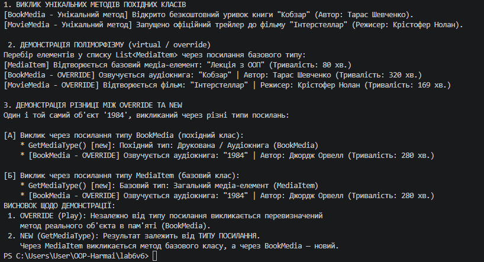

# Лабораторна робота №6: Наслідування та Поліморфізм у C#

## Тема
Наслідування. Ключові слова `base`, `override`, `virtual`. Приховування членів (`new`).

## Мета роботи
Навчитися створювати ієрархії класів, використовувати ключові слова `base`, `virtual`, `override` для реалізації поліморфізму, а також дослідити відмінності між перевизначенням методів (`override`) та приховуванням за допомогою модифікатора `new`.

## хід роботи 

**Реалізація базового класу `MediaItem`:**
   Описано приватні поля (`_title`, `_duration`) та публічні властивості.
   Створено конструктор та віртуальний метод `virtual void Play()`.
   Оголошено невіртуальний метод `GetMediaType()` для демонстрації приховування.

**Розробка похідних класів (`BookMedia` та `MovieMedia`):**
   Реалізовано наслідування від `MediaItem` із передачею параметрів через `base(...)`.
   Перевизначено віртуальний метод `Play()` за допомогою `override`.
   Додано унікальні методи `ReadSample()` та `ShowTrailer()`.
   У класі `BookMedia` застосовано модифікатор `new` до методу `GetMediaType()`.

**Демонстрація у `Program.cs`:**
    Створено об'єкти базового та похідних класів.
    Продемонстровано поліморфну поведінку при роботі зі списком `List<MediaItem>`.
    Продемонстровано різницю між `override` (залежить від типу об'єкта) та `new` (залежить від типу посилання).
    
    
